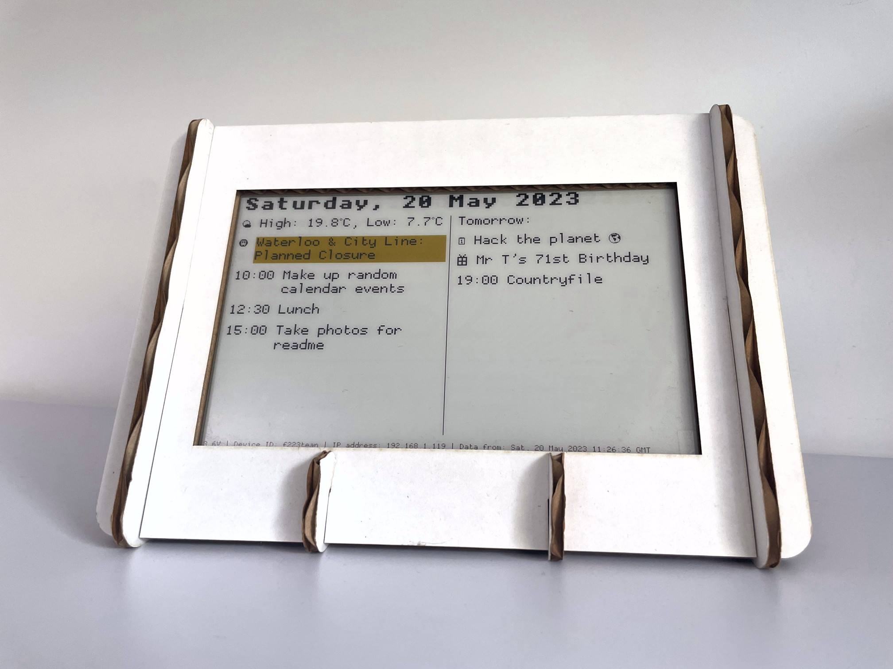

# StatusPanel

[](https://github.com/inseven/statuspanel/actions/workflows/build-app.yaml) [](https://github.com/inseven/statuspanel/actions/workflows/build-firmware.yaml) [](https://github.com/inseven/statuspanel/actions/workflows/build-website.yaml) [](https://github.com/inseven/statuspanel/actions/workflows/build-service.yaml) [](https://github.com/inseven/statuspanel/actions/workflows/build-raspberry-pi-image.yaml)

eInk desk calendar and status board

## Overview



Content is curated through an iOS app, meaning your StatusPanel can show events from any of the calendars you have on your phone, without sharing that content to any third-party service.

### Content Sources

The StatusPanel iOS app has built-in support for a number of content sources:

- Calendar
- [London Underground](https://tfl.gov.uk/modes/tube/) (UK)
- [ZenQuotes](https://zenquotes.io)

## Technical Details

- [Architecture](docs/architecture/index.markdown)
- Devices
    - Firmware
        - [NodeMCU](device/nodemcu/README.markdown)
        - [Python](device/python/README.md)
    - [Hardware](hardware/README.markdown)
- Clients
    - [iOS](ios/README.markdown)

- [Web Service](service/README.markdown)

## Development

StatusPanel follows the version numbering, build and signing conventions for InSeven Limited apps. Further details can be found [here](https://github.com/inseven/build-documentation).

### Dependencies

StatusPanel uses [Git Submodules](https://git-scm.com/book/en/v2/Git-Tools-Submodules), so before doing anything else, you'll need to do:

```bash
git submodule update --init --recursive
```

N.B. You'll also need to run this command if the submodules change.

Once your submodules are up-to-date, you can install the dependencies for all StatusPanel components using the `install-dependencies.sh` script:

```bash
scripts/install-dependencies.sh
```

This script installs all dependencies in the `.local` folder within the project root, does not require root, and should not impact your local machine configuration. Scripts that rely on these dependencies source the `scripts/environment.sh` script which configures the path at runtime.

Tools versioning for local development can be done with [asdf](http://asdf-vm.com) and `.tool-versions` is already set up correctly. In order to use `asdf`, you will need to have the NodeJS and Ruby plugins installed:

```bash
# Install required plugins.
asdf plugin add nodejs https://github.com/asdf-vm/asdf-nodejs.git
asdf plugin add python
asdf plugin add ruby https://github.com/asdf-vm/asdf-ruby.git

# Install appropriate tools versions.
asdf install
```

### Website

The website (https://statuspanel.io) is built using Jekyll and hosted on GitHub Pages. If you'd like to edit and serve locally, you run the following commands:

```bash
cd docs
bundle install
bundle exec jekyll serve
```

## Contributing

We invite and welcome contributions! There's a pretty comprehensive list of [issues](https://github.com/inseven/statuspanel/issues) to get you started, and our documentation is always in need of some care and attention.

Please recognise StatusPanel is a labour of love, and be respectful of others in your communications. We will not accept racism, sexism, or any form of discrimination in our community.

## Licensing

StatusPanel is licensed under the MIT License (see [LICENSE](LICENSE)).
