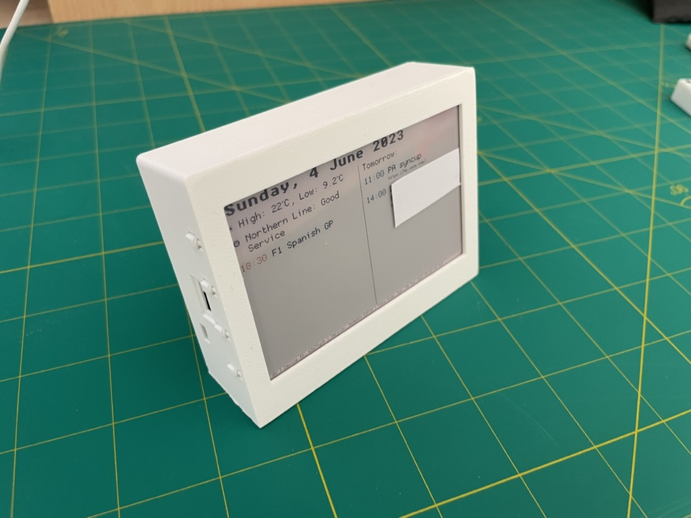
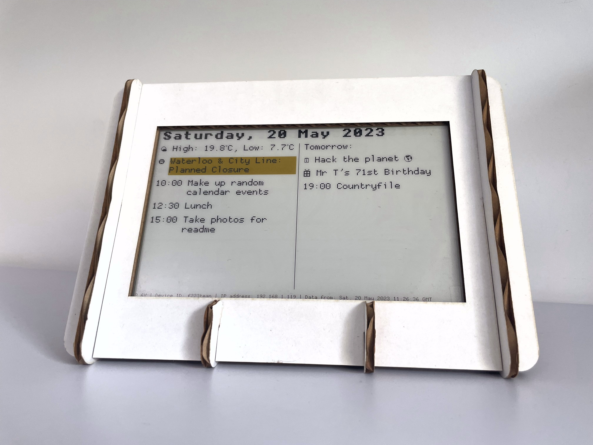
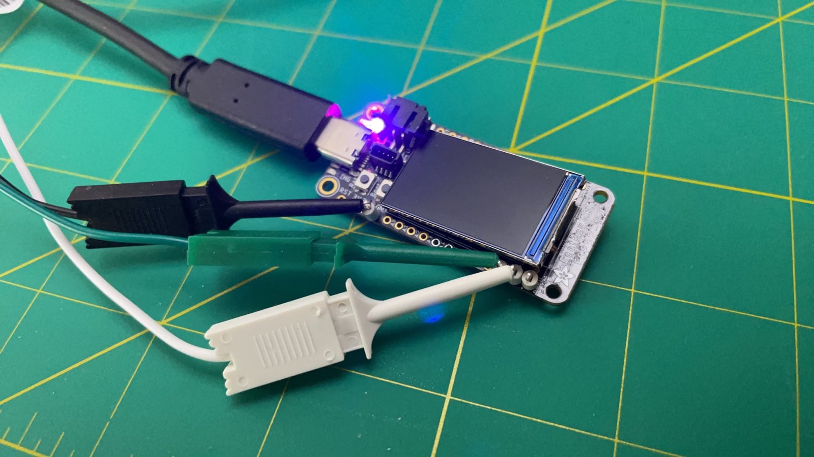
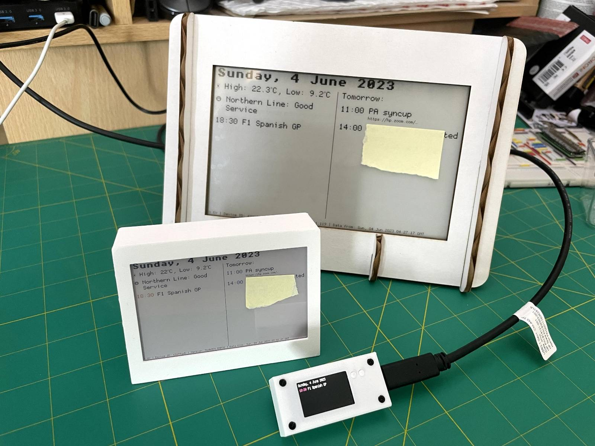

There are three versions of StatusPanel with each being defined by its choice of display:

<ul class="grid prefer-2-columns showcase">
    <li>
        <a href="v2">
            
            Version 2
        </a>
        
Based on the <a href="https://shop.pimoroni.com/products/inky-impression-4?variant=39599238807635">Pimoroni Inky Impression 4</a>.

    </li>
    <li>
        <a href="v1">
            
            Version 1 
        </a>
        
Based on the <a href="https://www.waveshare.com/7.5inch-e-paper-hat-c.htm">Waveshare 640x384 7.5" Three-Color E-Ink HAT for Raspberry Pi</a>.

    </li>
    <li>
        <a href="mini">
            
            Mini
        </a>
        
Based on the <a href="https://www.adafruit.com/product/5300">Adafruit ESP32-S2 TFT Feather.</a>

    </li>
</ul>

---

In order to ease prototyping and development, we have two hardware platforms:

- **ESP32** (Lua) \
  Low-power, robust to power cycling and perfect for battery powered devices.
- **Raspberry Pi** (Python) \
  Enables incredibly rapid bring-up and testing of new screens as they are often well supported on Raspberry Pis.

Our long-term focus is on designing a custom PCB for ESP32-based devices.
