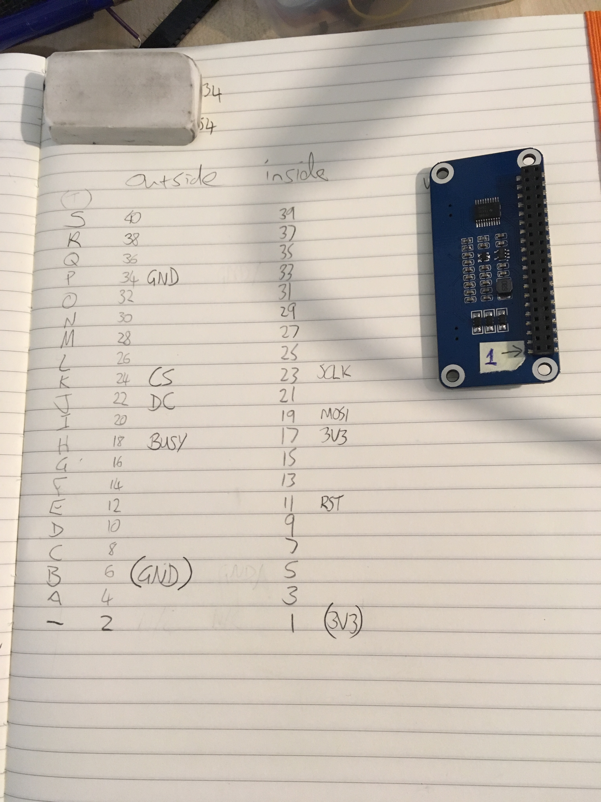

# PCB

# Bill of Materials

| *Part*                                                                              | *Link*                                              | *Cost* | *Quantity* |
| ----------------------------------------------------------------------------------- | --------------------------------------------------- | ------ | ---------- |
| Tactile Button Switch (6 mm)                                                        | [Adafruit](https://www.adafruit.com/product/367)                | $0.125 | 1          |
| Breadboard-friendly SPDT Slide Switch / E-Switch EG1218                             | [Adafruit](https://www.adafruit.com/product/805) / [Mouser](https://www.mouser.com/ProductDetail/E-Switch/EG1218)                | $0.95  | 1          |
| Adafruit HUZZAH32 – ESP32 Feather Board                                             | [Adafruit](https://www.adafruit.com/product/3405)               | $19.95 | 1          |
| 640x384, 7.5inch E-Ink display HAT for Raspberry Pi, yellow/black/white three-color | [Waveshare](https://www.waveshare.com/7.5inch-e-paper-hat-c.htm) | $53.99 | 1          |
| Diffused 3mm LED                                                                    | [Adafruit](https://www.adafruit.com/product/4202)               | $0.118 | 1          |

# Components

The EagleCAD files make use of the following component libraries which are added to the project as submodules:

- pcb/libraries/SparkFun-Eagle-Libraries/SparkFun-LED.lbr

# Schematics

# Pinouts

