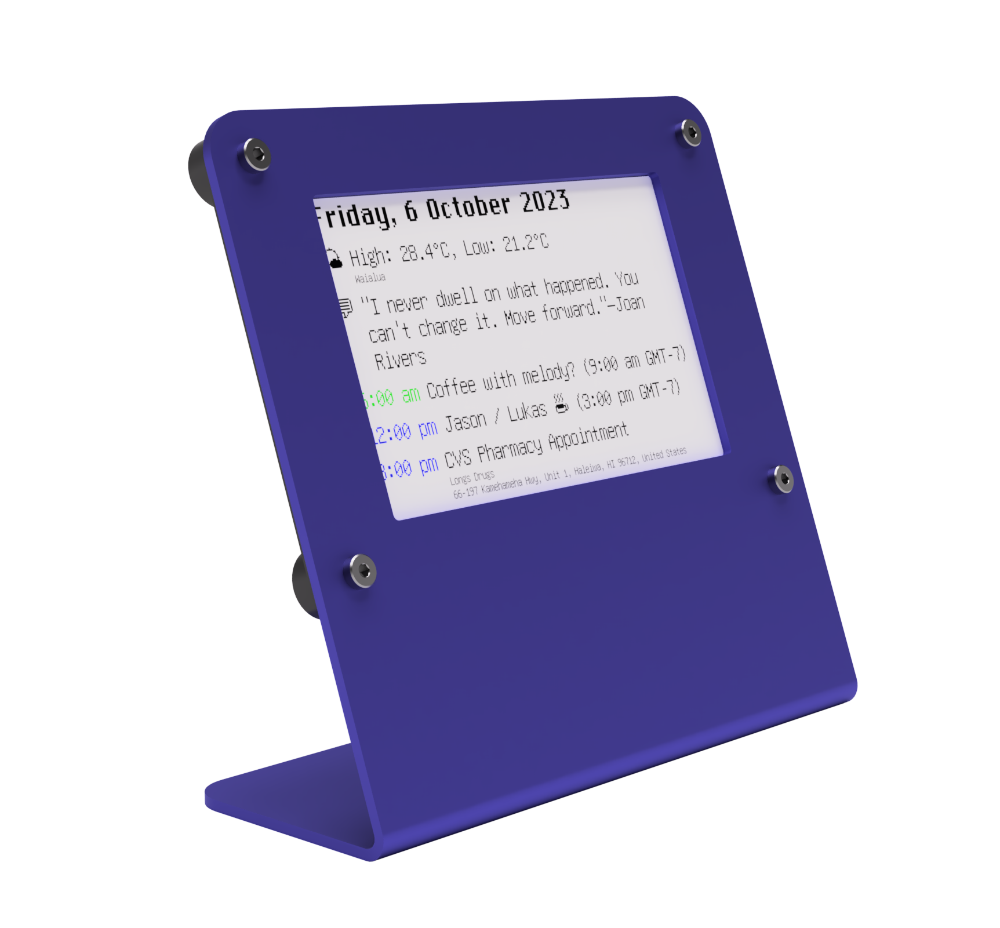

    StatusPanel is a modern take on the desk calendar. It shows you just what you need to know about your upcoming day, without the temptation of messages, social media feeds, or the other online distractions that come from checking your phone.

## Sources

Content is curated with our iOS app meaning StatusPanel can show events from any of the calendars you have on your phone, without sharing that content to any third-party service.

<ul>
    <li>

 Calendar</li>
    <li>

 <a href="https://tfl.gov.uk/modes/tube/">London Underground</a></li>
    <li>

 <a href="https://apps.apple.com/us/app/weather/id1069513131">Weather</a></li>
    <li>

 <a href="https://zenquotes.io">ZenQuotes</a></li>
</ul>
